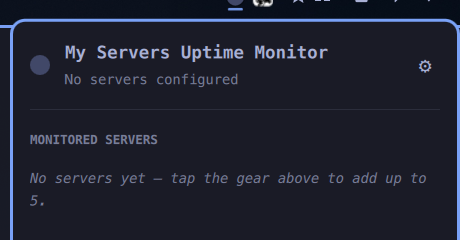
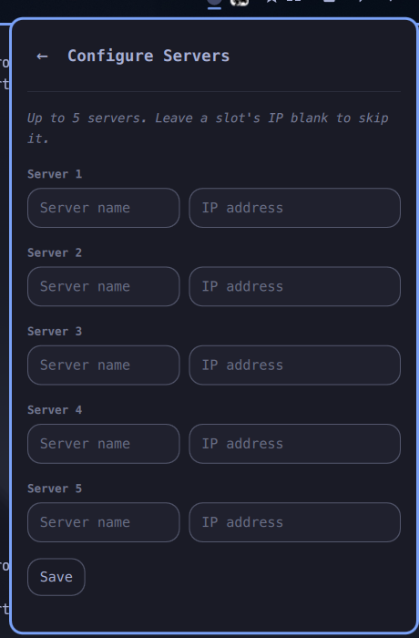

# My Servers Uptime Monitor

An [Omarchy](https://omarchy.org/) bar plugin that watches up to 5 servers by
IP and shows a status dot in the top bar:

- 🟢 **green** — every configured server answers a ping.
- 🔴 **red** — one or more configured servers don't.
- ⚪ **grey** — nothing configured yet, or the first check hasn't run yet.

Click the dot to open the status list. Click the gear in the top-right
corner to switch to the configuration page.

## Screenshots

| Status list | Configuration |
| --- | --- |
|  |  |

## Features

- Up to 5 monitored servers, each with a **name** and an **IP address**.
- A slot with a blank IP is skipped entirely — not shown in the list, not
  checked.
- Checks run automatically every 30 minutes, and immediately after saving
  changes or pressing "Check now".
- Two-page panel: the main page is just the live status list; the gear icon
  opens a dedicated settings page for the 5-slot editor, keeping the two
  concerns apart.

## Installation

```bash
omarchy plugin add https://github.com/elchacoveloz/my-servers-uptime-monitor.git --enable --yes
```

Or by hand:

```bash
git clone https://github.com/elchacoveloz/my-servers-uptime-monitor.git \
  ~/.config/omarchy/plugins/iserrano.uptime-monitor
omarchy-shell shell rescanPlugins
omarchy plugin enable iserrano.uptime-monitor
```

The widget lands in the bar's right section by default; move it with
`omarchy bar move iserrano.uptime-monitor --section <left|center|right>`.

## How checks work

Each configured server is checked with `ping -c 1 -W 2 <ip>` every 30 minutes,
and also right after you save the configuration page or press "Check now".

## Configuration storage

Server config lives outside `shell.json`, in its own state file:

`~/.local/state/omarchy/settings/uptime-monitor.json`

```json
{
  "servers": [
    { "name": "Web server", "ip": "203.0.113.10" },
    { "name": "", "ip": "" },
    { "name": "", "ip": "" },
    { "name": "", "ip": "" },
    { "name": "", "ip": "" }
  ]
}
```

You can also hand-edit this file directly; the panel picks up changes live.

## License

MIT — see [LICENSE](LICENSE).
